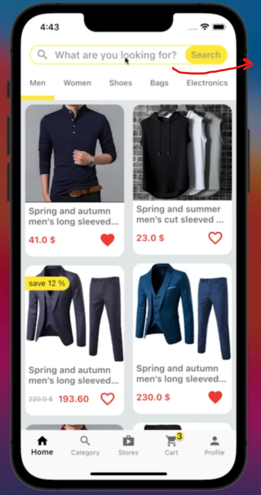
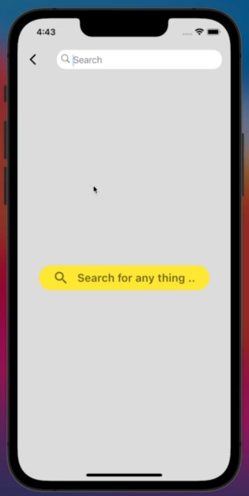
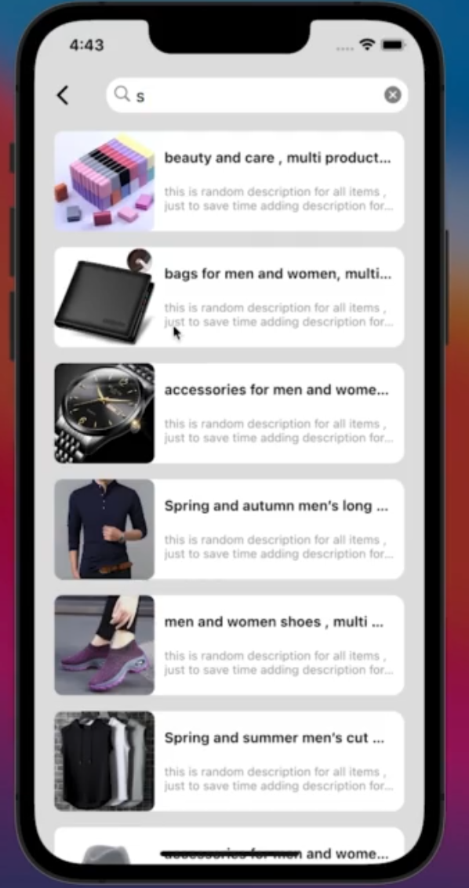
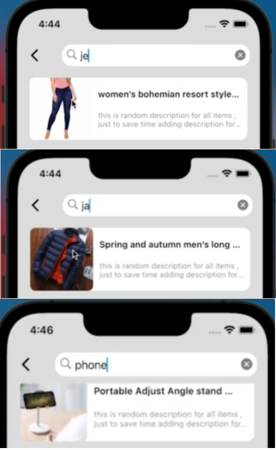

# multi_store_app

 flutter app project w/ udemy

creating an empty layout of the app

## Section Summaries

### 02 - layout [ V 1.0 ]

creating an empty layout of the app

 creating an empty layout of the app

||||
|--|--|--|

### 03 - Firebase Authentication [ Level 1 ]

add functionality to the signUp buttons

 we will add functionality for the sign up buttons

#### ⇒ it will consist of a sign Up page

|  |  |  |  |  |
|--|--|--|--|--|

- the sign up page will take the inputs of the given fields including the image
- it will also have the functionality to hide a password
- it will return any errors using the bottom yellow popup bar

#### It will also support a firebase connection

| || |
|--|--|--|

- this is due to the project containing a large amount of data,
- firebase will:
  - authenticate customers, &
  - store their data in a database, including their images

#### ⇒ we will also hold the ability to login into an existing account and switch b/w the login & signup pages

| || ||
|--|--|--|--|

#### ⇒ Same for suppliers

| supplier sign up | Store data for supplier|supplier login |
|--|--|--|

#### ⇒ now within the login

| ||||
|--|--|--|--|

#### ⇒ Now finally for guest

| | |
|--|--|

### 04 - Upload Product [ Cloud Firestore ]

now to work on the supplier side of the project like: uploading products to the app

we will now work in the supplier side of the project,
like uploading products to the app

| || |
|--|--|--|
||||

> **✏️NOTE:**
>
> we can pick multiple Images

the design of upload section is similar to that of signup page

- as it contains textfields which require regex to validate input,
- and also an image picker,

|||
|-|-|

we also work on stores for the suppliers
|||
|-|-|

### 05 - Streaming Data to Application

showing items from Firebase to app

 

clicking on buttons gives:
|||
|-|-|

|stores section|inside each store:|on clicking each product|more pictures upon clicking the main picture|
|-|-|-|-|
| || | |

### 06 - State Management [ Add To Cart - Wishlist ]

Adding To Cart/Wishlist

in this section:

#### 1 - Adding to wishlist

|||
|-|-|

#### 2 - adding to cart

|||
|-|-|

can increment items in cart

delete items from cart

clear cart w/ the button above

add to cart from product_details page

by clicking the 'added to cart' button snackbar appears

incrementing stops after reaching max items in stock
and math done for total price of all items

|| |
|-|-|

### 07 - Checkout & Upload Order

Checkout further handles customer requests like: confirming order

|The checkout button is now functioning|upon clicking the checkout button: |upon clicking the confirm order: |upon confirming order: |
|-|-|-|-|
|||||
||we land on placeOrder phone and address not present for now|different price generated because of shipping cost (for now payment method will be cash only)|cart is cleared and the the order is placed in the Order page in profile|

|the orders page has cards which contain confirmation of review and delivery status|this one has status: **preparing**|
|-|-|
|||

### 08 - Dashboard Components

 dealing with supplier orders in dashboard

|clicking orders tab|clicking on an order |declaring as delivered|brings it to delivered tab|each order shows customer info.|
|-|-|-|-|-|
||||||

|statics screen|shows statistics|Balance screen|shows balance|
|-|-|-|-|
|||||

### 09 - Adding Discount to products

 Adding Discount to products

|New field for input| Taking Input|
|-|-|
|||
||This textfield takes in a number b/w 1-100 and gives a % discount accordingly,|
||here the discount will be 14% |

|showcase in home screen|changed price|discount price instead of actual price|
|-|-|-|
||||

### 10 - Search Engine ====== end of v1.0

 Working on the search engine to navigate through products

|by clicking the search bar|Empty prompt screen|Results in search bar correspond to prompt|result for 'ja', 'je', 'phone' |
|-|-|-|-|
|||||
|we are sent to a page that showcases all the results matching the prompt|| E.g: 's' shows all results with the letter 's' in their name|gives results such as 'ja'cket, 'je'ans, and various products with 'phone in their name |

### 11 - Flutter 3

 

- 001 Migration to Flutter 3

### 12 - Payment Online ( Flutter Stripe ) [ V1.1 ]

 

- 001 Install Stripe to Application
- 002 Payment Sheet
- 003 Passing Total Payment value

### 13 - Adding Review to Products

 

- 001 Rate & Comment
- 002 Uploading Review
- 003 Streaming Reviews into Product Details
- 004 Review Model [unsolved challenge]

### 14 - Edit Store [ Supplier ]

 

- 001 Replace Store logo
- 002 Replace Cover Image & edit store info
- 003 Save Changes p1
- 004 Save Changes p2

### 15 - Edit Products [ Supplier ]

 

- 001 Current Images & Categories
- 002 Edit Images & Categories
- 003 Current Item Data
- 004 Save Changes [ unsolved Challenge]
- 005 Delete Product

### 16 - How to Think [ Customer Multiple Address ]

 

- 001 Adding Multiple Addresses Challenge [ Solved ]
- 002 Add New Address p1 [ Form ]
- 003 Add New Address p2 [ Country Picker ]
- 004 Add New Address p3 [ Upload Data ]
- 005 Address Book p1 [ Streaming Data ]
- 006 Address Book p2 [ Set As Default ]
- 007 Pass Default Address to Place Order
- 008 Check If Address Book is empty !
- 009 Pass Data to Payment Screen
- 010 Update Customer Profile
- 011 Processing & Delete Address

### 17 - Authentication [ Level 2 ]

 

- 001 Send Email Verification
- 002 Check Email Verification
- 003 Re-Send Email Verification
- 004 Firebase Auth User Data
- 005 Refactor Authentication Methods
- 006 Forgot Password
- 007 Change Password p1 [ Old Password Validation ]
- 008 Change Password p2 [ Strong Password Validation ]
- 009 Change Password p3 [ Set New Password ]
- 010 Layout Changes [ UI & UX Promise ]
- 011 Google Sign in [ install & necessary implementation]
- 012 Google Sign in [ Sign In & Upload Data ]
- 013 Google Sign in [ User Document Existing]
- 014 Google Sign in [ Listen to Current User ]

### 18 - On Boarding Screen ======end of v1.1

 

- 001 You Will Love This Section
- 002 Skip Button
- 003 Skip On Timer
- 004 Offer.watches [ sub-collection ]
- 005 Offer.shoes [ main collection ]
- 006 Offer.sale [ discount ]
- 007 Random Offer
- 008 Navigator Switch
- 009 Positioned Widgets
- 010 Animated Container
- 011 Animated Opacity

### 19 - Suppliers' App vs Customers' App ( Build & Revision ) ..... [ v1.2 ]

 

- 001 Create Two Apps
- 002 Copy Files ( Suppliers' App )
- 003 Run On Android
- 004 Run On iOs
- 005 Login As A Supplier
- 006 Copy Files & Android Build ( Customers' App )
- 007 Run On iOs
- 008 Login As A Customer
- 009 CustSupp Login ( half solved challenge)

### 20 - Remember Me( Shared Preferences )

 

- 001 Shared Preferences [ counter example ]
- 002 Set & Get Supplier Id
- 003 Current User [ Supplier Id ]
- 004 Set & Get Customer Id
- 005 Current User [ Customer Id ]
- 006 Remember Me

### 21 - SQL + Provider[ shopping items database ]

 

- 001 Flutter + SQL [ shopping items ]
- 002 Create Databse [ Notes App ]
- 003 Insert & rawInsert
- 004 Retrieve Data
- 005 Update & rawUpdate
- 006 Delete & rawDelete
- 007 Delete All Items
- 008 Upgrade Database ( ADD COLUMN )
- 009 Upgrade Database ( Todos Table )
- 010 Batch
- 010 sql-notes.zip
- 011 SQL + Provider [ Revision ]
- 012 Update the State [ Consumer ]
- 013 SQL + Provider [ Add Item ]
- 014 Existing in Database
- 015 SQL + Provider [ Load Notes ]
- 016 SQL + Provider [ delete & update ]
- 017 SQL + Provider [ clear items ]
- 017 sql-provider.zip
- 018 APPLY TO APP [ SHOPPING ITEMS ]
- [018 SQL-Tutorial-Full-Database-Course-for-Beginners-freeCodeCamp-.url](https://www.youtube.com/watch?v=HXV3zeQKqGY&t=6618s)

### 22 - Prefs + Provider [ Customer ID ]

 

- 001 Prefs - Provider p1 [ Revision ]
- 002 Prefs - Provider p2 [ Extract Methods ]
- 003 Prefs - Provider p3 [ Notify Listeners ]
- 004 Prefs - Provider p4 [ Track customer ID ]

### 23 - Notifications [ FCM ]

 

- 001 Notifications - Summary
- 002 Android Emulator Requirements
- 003 FCM library
- 004 Test Message ( Background & Terminated )
- 005 Background Messages Handler
- 006 Foreground Messages
- 007 Notification Channels ( Overview )
- 008 Create Notification Channel
- 009 Display Notification ( Heads-up Notifications )
- 010 Customers App ( Revision )
- 011 FollowUnfollow ( Save To Database )
- 012 Test Message ( Target a Topic )
- 013 Test Message ( send to token )
- 014 Handling Interactions

### 24 - Security Rules

 

- 001 FireStore [ Security Rules ]
- 002 Getting Started With Security Rules ( Customers Collection )
- 003 Rules ( subCollection )
- 004 Rules ( Suppliers Collection )
- 005 Rules ( Functions )
- 006 Rules ( Products - get method )
- 007 Rules ( Products - delete document )
- 008 Rules ( Reviews - exists method )
- 009 Rules ( Orders Collection )
- 010 Rules ( update - transactions )
- 011 Rules ( Admins )
- 012 Rules ( format Rules into functions )
- 013 Rules ( Test on App )
- 014 One More Step to Secure Data

[//]: <> (This is also a comment.)
[//]: <> (https://stackoverflow.com/questions/51287097/how-do-you-delete-lines-with-certain-keywords-in-vscode)
[//]: <> (https://stackoverflow.com/questions/4823468/comments-in-markdown)
[//]: <> (https://stackoverflow.com/questions/33648152/regex-match-numbers-greater-or-equal-than-20-by-increments-of-5-range-20-to-99)
